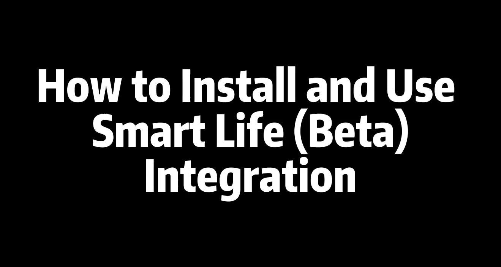

# Smart Life (Beta) Home Assistant Integration

:warning: **This project has now officially been integrated into the Home Assistant official project core repository, corresponding to version 2024.2. This project will no longer continue to iterate. Subsequent iterations and support will be carried out under the Home Assistant official project. If you have any questions, please communicate at https://github.com/home-assistant/core/issues. Thank you.**

If you like Tuya Smart Life (Beta) Integration, please give it a star or fork it and contribute!

# Smart Life（Beta）Integration Documentation

    

The Smart Life（Beta）integration is developed for controlling **Powered by Tuya (PBT)** devices using the [tuya-device-sharing-sdk](https://github.com/tuya/tuya-device-sharing-sdk), and maintained by the official Tuya Developer Team. 

It is currently in **beta testing**, and there is still room for improvement in terms of functionality and stability. Feel free to install and try it out.

We really appreciate your contributions and awesome ideas to this project. We are happy to hear your voices at [GitHub Discussions](https://github.com/tuya/tuya-smart-life/discussions) to make our integration better. 

Please provide feedback to Tuya through [Github Issues](https://github.com/tuya/tuya-smart-life/issues/) to help us improve and optimize it.

## Important Note
### What's the difference between "Tuya" and "Smart Life" Integrations?

1. [Tuya Integration](https://www.home-assistant.io/integrations/tuya/) relies on [Tuya IoT Core Service subscription](https://iot.tuya.com/cloud/products/detail?abilityId=1442730014117204014), if the subscription has expired, the integration will stop working. Users are required to manually extend the trial subscription period, which can be inconvenient and frustrating.

2. Tuya Smart Life (Beta) integration has removed the Tuya cloud development workflow, allowing users to simply scan and log in using the [Smart Life app](https://developer.tuya.com/en/docs/iot/tuya-smart-app-smart-life-app-advantages?id=K989rqa49rluq), and then seamlessly sync their IoT devices directly to Home Assistant. It offers a simplified and efficient solution.

**Note:** If you are transitioning from the **Tuya Integration** to the **Smart Life (Beta) integration**, it may be necessary to set up all your devices again within your Smart Life app account. The migration process does not support directly transferring devices from one integration to the other.

## Installation Guide
[How to Install Smart Life Integration (Beta)](https://developer.tuya.com/en/docs/iot/Smart_Life_Integration?id=Kd0gk9baikbb7)

## Video Guide

## Prerequisites

Your devices need to first be added in the [Smart Life app](https://developer.tuya.com/en/docs/iot/tuya-smart-app-smart-life-app-advantages?id=K989rqa49rluq).

## Supported Tuya Device Categories
Seven primary categories, 50 secondary categories are supported now!

:clap: [Supported Device Category](./docs/supported_devices.md)

## Category/Standard Instruction Set Expansion Development

When developers find that a certain functionality is not supported in Smartlife, developers can develop that support following these steps:

#### Step 1: Download and Review Diagnostic File 

Download the diagnostic file and review the category and supported standard instruction set data of the device.
* `data["category"]`: Device category
* `data["function"]` and `data["status_range"]`: Standard instruction set's Data type and Value description
* `data["status"]`: Value of the standard instruction set
* See the [Standard Instruction Set Document](https://developer.tuya.com/en/docs/iot/standarddescription?id=K9i5ql6waswzq) available in the [Home Assistant Entity Development Guide](https://developers.home-assistant.io/docs/core/entity) for more details.

#### Step 2: Refer to Smartlife's Supported Entity Code Files

Smartlife supports 16 entity code files:
[Code file address](https://github.com/tuya/tuya-smart-life/tree/main/custom_components/smartlife)
1. `alarm_control_panel.py` 
2. `binary_sensor.py` 
3. `button.py` 
4. `camera.py`
5. `climate.py`
6. `cover.py`
7. `fan.py`
8. `humidifier.py`
9. `light.py`
10. `number.py`
11. `scene.py`
12. `select.py`
13. `sensor.py`
14. `siren.py`
15. `switch.py`
16. `vacuum.py`

Add the entity's support in the relevant file(s) as per the Standard Instruction Set in the Home Assistant Entity Development Guide. If the existing files don't suffice, you can add new entity files to accommodate new entity types.

#### Step 3: Test Before Submitting PR

Finally, ensure that the modifications are tested locally before submitting your PR.

#### Example - Adding Functionality 

As an example, you may need to add numeric display functionality for the standard instruction "cur_current" under the "dlq" category in `sensor.py`. Locate the "dlq" category in the SENSORS dictionary (add it if not already present), and implement support for the standard instruction "cur_current".
[Code Linking](https://github.com/tuya/tuya-smart-life/blob/main/custom_components/smartlife/sensor.py#L829-L835)

### Pull Requests Workflow

1. **Fork the project**: Developers first need to fork the `dev` branch of our project *smartlife* on GitHub to their own accounts.

2. **Start development**: On the newly forked branch, developers make modifications and further developments to category and standard instruction sets.

3. **Commit changes**: After the development is accomplished, developers need to commit their changes to their GitHub repositories.

4. **Create a Pull Request**: Developers then need to create a Pull Request in their GitHub repository, requesting their modifications to be merged into your `dev` branch.

5. **Review the Pull Request**: The submitted Pull Requests need to be reviewed.

6. **Testing**: The internal staff regularly carry out tests.

7. **Merge to `main`**: If the tests on the `dev` branch show no issues, then the changes are merged into the `main` branch.

8. **Release a new version**: On the `main` branch, release a new version for users.

## Follow Us

Follow us to get more information and leading technology on the Internet of Things, as well as updates and activities on the [Tuya IoT Developer Platform](https://developer.tuya.com/?_source=6d8d369b1b09336f622047669af507c4)

## Issue Feedback

You can give feedback on issues you encounter for the project via **GitHub Issue**.

## Related Projects

- [Tuya Device Sharing SDK](https://github.com/tuya/tuya-device-sharing-sdk)

## LICENSE

For more information, please refer to the [LICENSE](LICENSE) file.
